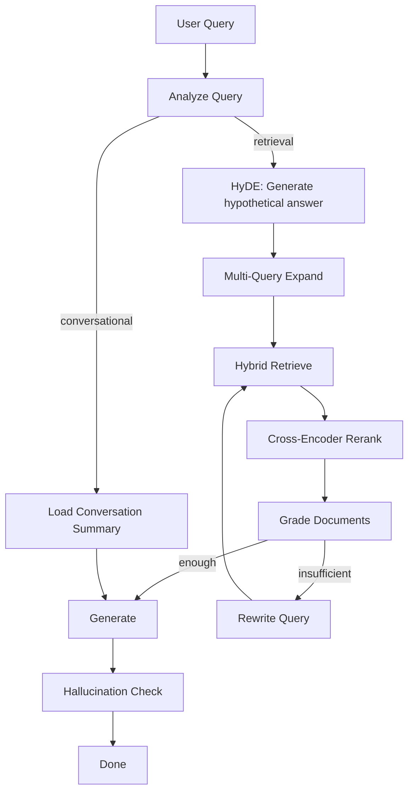
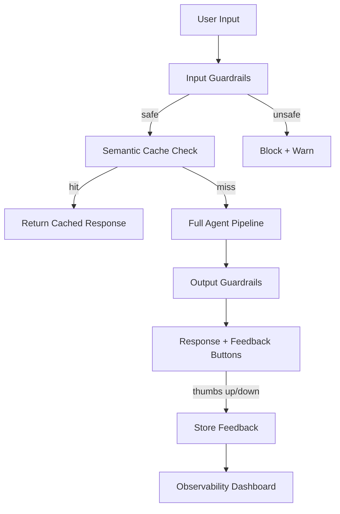

# Advanced RAG Phases (5, 6, 7)

The current system (Phases 1-4) covers: chat + Supabase, basic RAG, hybrid retrieval, and intelligent agent (grading, rewriting, hallucination check). These three new phases address the biggest remaining gaps in quality, reliability, and production-readiness.

---

## Current Gaps (Why More Phases)

- **No reranking** after retrieval -- hybrid search returns candidates but a cross-encoder reranker can boost precision by ~28%.
- **No evaluation framework** -- you can't improve what you don't measure. No RAGAS or faithfulness metrics.
- **No conversation memory** -- long conversations overflow the context window; no summarization of older turns.
- **No user feedback** -- no thumbs up/down, no way to learn from mistakes.
- **No caching** -- identical or similar questions always run the full pipeline (multiple LLM calls).
- **No guardrails** -- no input/output filtering, no PII detection.
- **No multimodal** -- tables and images in PDFs are lost.
- **Hardcoded limits** -- RETRIEVE_TOP_K, chunk sizes, RRF_K, model names all baked into code.

---

## Phase 5 -- Quality and Measurement

**Goal:** Measurably improve answer quality with reranking, HyDE, conversation memory, and an evaluation framework.

### 5A. Cross-Encoder Reranking

- Add a **rerank step** between retrieve and grade: after hybrid search returns ~20 candidates, a cross-encoder (e.g. `ms-marco-MiniLM-L-6-v2` via `sentence-transformers`, or Cohere Rerank API) scores each candidate against the query and picks the top-K.
- New file: `backend/app/reranker.py`.
- Update [backend/app/agent/nodes.py](backend/app/agent/nodes.py): add `rerank_node` between `hybrid_retrieve_node` and `grade_documents_node`.
- Update [backend/app/agent/stream.py](backend/app/agent/stream.py): add status "Reranking..." and call rerank_node.
- **Impact:** ~28% NDCG improvement, 35% hallucination reduction in studies.

### 5B. HyDE (Hypothetical Document Embeddings)

- Before embedding the query for dense search, generate a **hypothetical answer** with the LLM, then embed that answer instead. Answer-to-answer matching outperforms question-to-answer matching.
- Add `hyde_node` in nodes.py; update expand_query_node to use HyDE embedding.
- New prompt `HYDE_SYSTEM` in [backend/app/agent/prompts.py](backend/app/agent/prompts.py).

### 5C. Conversation Memory (Summarization)

- For long conversations (>10 messages), summarize older messages into a condensed "conversation summary" and keep only the last N turns verbatim. This prevents context overflow and keeps retrieval queries focused.
- Add `summarize_history_node` that runs before analyze_query when history exceeds a threshold.
- Store summaries in a new `session_summary` column on `chat_sessions` (SQL migration).
- New prompt `SUMMARIZE_HISTORY_SYSTEM` in prompts.py.

### 5D. RAGAS Evaluation Framework

- Add an evaluation script (`backend/eval/evaluate.py`) that:
  - Takes a set of question-answer-context triples.
  - Computes **Faithfulness** (claims supported by context), **Answer Relevancy**, **Context Precision**, **Context Recall**.
  - Outputs scores to a JSON/CSV report.
- Add a small test set (`backend/eval/test_set.json`) with sample questions and expected answers.
- Not integrated into the main app; run manually after pipeline changes to track quality regressions.

### 5E. Configurable Agent Parameters

- Move hardcoded constants to [backend/app/config.py](backend/app/config.py): `RETRIEVE_TOP_K`, `MIN_RELEVANT_DOCS`, `MAX_REWRITE_COUNT`, `MAX_HALLUCINATION_RETRY`, `RRF_K`, `PARENT_CHUNK_SIZE`, `CHILD_CHUNK_SIZE`, `CHAT_MODEL`, `EMBEDDING_MODEL`, `RERANKER_MODEL`, `RERANKER_TOP_K`.
- All configurable via env vars with sensible defaults.

### Phase 5 Docs

- `docs/phase-5-setup.md`
- `docs/concepts/reranking.md` -- cross-encoder vs bi-encoder, when to use
- `docs/concepts/hyde.md` -- hypothetical document embeddings explained
- `docs/concepts/evaluation-ragas.md` -- how to measure RAG quality

---

## Phase 6 -- Production Hardening

**Goal:** Make the system production-ready with caching, guardrails, user feedback, and observability.

### 6A. Semantic Caching

- Before running the agent, embed the user query and check against a cache of recent (query_embedding, response, sources) pairs. If cosine similarity > threshold (e.g. 0.92), return the cached response instantly.
- New file: `backend/app/cache.py` (use a simple in-memory dict with embeddings or a small pgvector table `query_cache`).
- SQL migration: `sql/supabase_phase6.sql` (query_cache table).
- Cache invalidation: when documents are re-processed, clear cache entries related to those files.
- **Impact:** 10x cost reduction and near-instant responses for repeated/similar questions.

### 6B. Input/Output Guardrails

- **Input:** Before processing, check for prompt injection patterns, off-topic queries, and optionally PII. Reject with a polite message.
- **Output:** Before sending the response, check for PII leakage, toxic content, or policy violations. Redact or warn.
- New file: `backend/app/guardrails.py` with `check_input(text) -> (safe: bool, reason: str)` and `check_output(text) -> (safe: bool, cleaned: str)`.
- Integrate into stream.py before analyze_query and after generate.
- New prompts in prompts.py for guardrail classification.

### 6C. User Feedback (Thumbs Up/Down)

- Frontend: add thumbs up/down buttons below each assistant message.
- Backend: `POST /api/feedback` endpoint storing `{ message_id, session_id, rating: "up"|"down", created_at }`.
- SQL: `feedback` table.
- New component: `FeedbackButtons.tsx` in frontend.
- Update [frontend/src/components/ChatInterface.tsx](frontend/src/components/ChatInterface.tsx) to show buttons after assistant messages.
- **Long-term:** Use negative feedback to build evaluation test sets and fine-tuning data.

### 6D. Observability Dashboard

- Backend: `GET /api/stats` endpoint returning aggregate metrics: total chats, messages, documents, average response time, feedback ratio (up/down), cache hit rate.
- Frontend: new `StatsPage.tsx` component (simple cards/charts).
- Update sidebar with a "Stats" nav item.
- Optional: integrate Langfuse for detailed per-request tracing (alternative to LangSmith).

### 6E. Graceful Error Recovery

- If any agent node fails (e.g. OpenAI timeout), fall back to a simpler pipeline (e.g. skip grading, skip hallucination check) instead of erroring out entirely.
- Add fallback logic in stream.py: if grade fails, keep all docs; if hallucination check fails, skip it; if retrieve fails, generate with no-context prompt.

### Phase 6 Docs

- `docs/phase-6-setup.md`
- `docs/concepts/semantic-caching.md`
- `docs/concepts/guardrails.md`

---

## Phase 7 -- Advanced Intelligence

**Goal:** Push the system toward state-of-the-art with multimodal support, semantic chunking, web search fallback, and citation linking.

### 7A. Multimodal RAG (Tables and Images)

- Use a vision-capable model or table extraction library to handle **tables in PDFs** (e.g. `camelot` or `unstructured` with table strategy).
- Store extracted table text as separate chunks with `type: "table"` metadata.
- For images: extract with `unstructured`, store descriptions as chunks, optionally embed images with a vision model.
- Update [backend/app/document_processor.py](backend/app/document_processor.py).

### 7B. Semantic / Contextual Chunking

- Replace fixed-size splitting with **semantic chunking**: detect topic boundaries using embedding similarity between consecutive sentences. Split where similarity drops below a threshold.
- Prepend **contextual headers** to each chunk (document title, section name) so embeddings capture where the chunk came from.
- New chunking strategy in document_processor.py; configurable via config.

### 7C. Web Search Fallback

- When the agent grades all documents as irrelevant (even after rewrite), instead of saying "I don't have the answer," optionally **search the web** (e.g. Tavily, SerpAPI, or Bing Search API).
- New node `web_search_node` in nodes.py; add to stream.py as a conditional fallback after grade_documents when graded_docs is empty.
- Clearly mark web-sourced answers in the UI (different source badge).

### 7D. Inline Citations

- Modify the generate prompt to produce **inline citations** like `[1]`, `[2]` referencing specific source chunks.
- Parse citations in the frontend and link them to the Sources section (clicking `[1]` scrolls to or highlights Source 1).
- Update prompts.py with citation instructions; update ChatInterface.tsx to render citation links.

### 7E. Domain Embedding Fine-Tuning

- Provide a script (`backend/eval/fine_tune_embeddings.py`) that:
  - Takes query-passage pairs from user feedback (positive = relevant, negative = irrelevant).
  - Fine-tunes a sentence-transformer model with contrastive loss.
  - Exports the fine-tuned model for use as the embedding model.
- Configurable embedding model name in config so users can swap in their fine-tuned model.

### Phase 7 Docs

- `docs/phase-7-setup.md`
- `docs/concepts/semantic-chunking.md`
- `docs/concepts/multimodal-rag.md`
- `docs/concepts/inline-citations.md`

---

## Phase Summary

| Phase | Focus                 | Key Additions                                                                        |
| ----- | --------------------- | ------------------------------------------------------------------------------------ |
| **5** | Quality + Measurement | Reranking, HyDE, conversation memory, RAGAS eval, configurable params                |
| **6** | Production Hardening  | Semantic cache, guardrails, user feedback, observability, error recovery             |
| **7** | Advanced Intelligence | Multimodal, semantic chunking, web fallback, inline citations, embedding fine-tuning |

Each phase builds on the previous and can be implemented independently. Phase 5 has the highest impact on answer quality. Phase 6 is essential before any real deployment. Phase 7 pushes toward state-of-the-art.