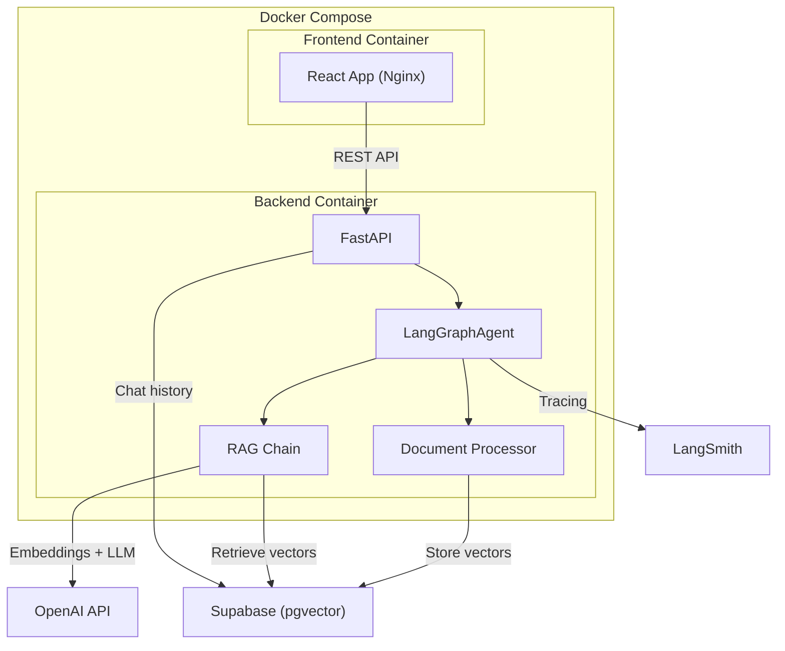
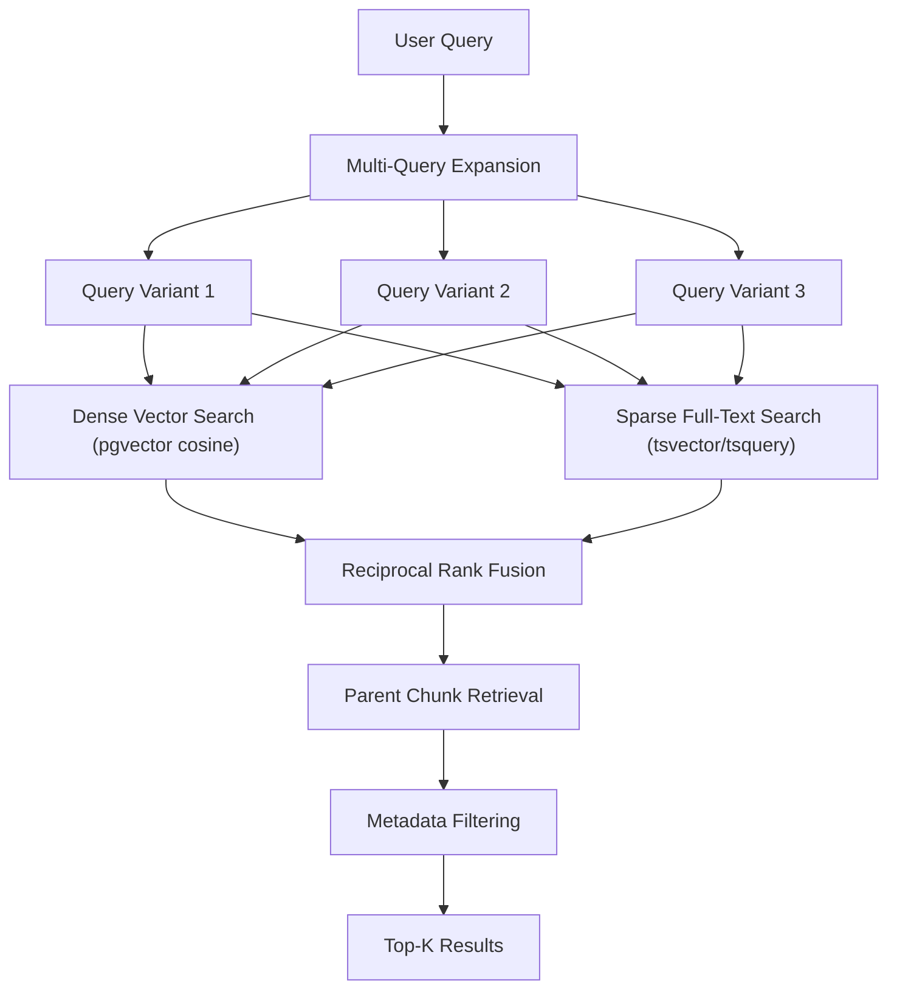
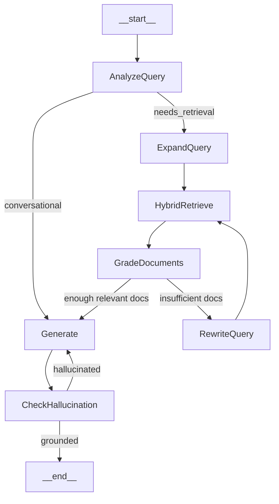

# LangGraph RAG Agent with Docker, Supabase, React, and LangSmith

## Architecture Overview




## Project Structure

```
Rag docker/
├── backend/
│   ├── app/
│   │   ├── main.py              # FastAPI app + CORS + SSE streaming
│   │   ├── agent.py             # LangGraph RAG agent (7 nodes, conditional edges)
│   │   ├── retriever.py         # Hybrid search: dense + sparse + RRF + parent lookup
│   │   ├── document_processor.py # Multi-level chunking + embedding pipeline
│   │   ├── supabase_client.py   # Supabase connection + RPC calls
│   │   ├── schemas.py           # Pydantic models
│   │   └── config.py            # Settings from env vars
│   ├── requirements.txt
│   └── Dockerfile
├── supabase_setup.sql           # Full migration: tables, indexes, RPC functions
├── frontend/
│   ├── src/
│   │   ├── App.tsx
│   │   ├── main.tsx
│   │   ├── components/
│   │   │   ├── ChatInterface.tsx  # Chat UI with message history
│   │   │   ├── FileUpload.tsx     # Drag-and-drop file upload
│   │   │   └── Sidebar.tsx        # Chat sessions list
│   │   ├── api/
│   │   │   └── client.ts         # API calls to backend
│   │   └── types/
│   │       └── index.ts
│   ├── package.json
│   ├── vite.config.ts
│   ├── Dockerfile
│   └── nginx.conf
├── docker-compose.yml
├── .env.example
└── README.md
```

## Backend Details

### Tech Stack

- **Python 3.11**, **FastAPI**, **LangGraph**, **LangChain**, **OpenAI**
- **supabase-py** for direct Supabase access + raw SQL via `postgrest`/`rpc` for hybrid search
- **LangSmith** tracing via environment variables

### Key Dependencies (`requirements.txt`)

- `fastapi`, `uvicorn[standard]`, `python-multipart`
- `langgraph`, `langchain`, `langchain-openai`, `langchain-community`
- `supabase`, `vecs` (Supabase pgvector client)
- `python-docx`, `pypdf`, `openpyxl`, `unstructured` (document loaders)
- `tiktoken` (accurate token-based chunking)
- `python-dotenv`, `langsmith`

### API Endpoints

- `POST /api/upload` -- Upload documents (multipart), process + store embeddings in Supabase pgvector
- `POST /api/chat` -- Send a message, get RAG-augmented response (streamed via SSE)
- `GET /api/chats` -- List all chat sessions
- `GET /api/chats/{id}` -- Get chat history for a session
- `DELETE /api/documents/{id}` -- Remove a document and its embeddings
- `GET /api/documents` -- List uploaded documents

---

### Advanced Retrieval Architecture




#### 1. Hybrid Search (Dense + Sparse)

Both searches run in a single Supabase RPC call for efficiency:

- **Dense search:** Embed the query with OpenAI `text-embedding-3-small` (1536 dims), search using pgvector cosine distance (`<=>` operator) with HNSW index
- **Sparse search:** PostgreSQL full-text search using `tsvector` column + `ts_rank_cd` scoring with `websearch_to_tsquery` for natural language query parsing
- **Combined via Reciprocal Rank Fusion (RRF):** A custom SQL function `hybrid_search()` that runs both searches, computes `1/(k+rank_dense) + 1/(k+rank_sparse)` for each result, and returns the top-K by combined score (k=60 constant)

#### 2. Multi-Query Expansion

Before retrieval, the LLM generates 3 alternative phrasings of the user's question to improve recall. All variants are searched in parallel, and results are deduplicated by chunk ID before RRF scoring.

#### 3. Parent-Child Chunking Strategy

Documents are split at two granularity levels:

- **Parent chunks** (2000 tokens, 200 overlap): Stored in `parent_chunks` table, used as the final context passed to the LLM
- **Child chunks** (500 tokens, 50 overlap): Stored in `documents` table with `parent_id` FK, used for search matching

When a child chunk matches, the system retrieves its parent chunk to give the LLM broader context. This improves answer quality by matching on precise segments but generating from larger context windows.

#### 4. Metadata Filtering

Every chunk stores rich metadata in a JSONB column:

- `file_id`, `filename`, `file_type`, `page_number` (for PDFs), `chunk_index`
- Queries can optionally filter by file or file type before search

#### 5. Document Grading (in LangGraph agent)

After retrieval, the LLM grades each document chunk as `relevant` or `irrelevant` to the question. Only relevant chunks proceed to generation. If fewer than 2 relevant chunks remain, the agent rewrites the query and retries retrieval once.

---

### LangGraph Agent Design




**Agent State:**

- `question` -- original user question
- `expanded_queries` -- list of multi-query variants
- `documents` -- retrieved and graded document chunks
- `messages` -- full chat history for the session
- `session_id` -- chat session identifier
- `generation` -- the LLM's answer
- `retry_count` -- prevents infinite loops (max 1 retry)

**Node Details:**

- **AnalyzeQuery:** Classifies if the query needs document retrieval or is a conversational follow-up (greeting, clarification, etc.)
- **ExpandQuery:** Generates 3 query variants using the LLM for better recall
- **HybridRetrieve:** Calls Supabase `hybrid_search()` RPC with all query variants, fetches parent chunks, deduplicates results
- **GradeDocuments:** LLM grades each chunk as relevant/irrelevant. Routes to `Generate` if >= 2 relevant docs, else to `RewriteQuery`
- **RewriteQuery:** LLM rephrases the question to find better matches (max 1 retry)
- **Generate:** Produces the answer using relevant docs + chat history with OpenAI `gpt-4o-mini`
- **CheckHallucination:** LLM verifies the answer is grounded in the retrieved documents. If hallucinated, regenerates once

LangSmith tracing is enabled via env vars (`LANGCHAIN_TRACING_V2=true`, `LANGCHAIN_API_KEY`, `LANGCHAIN_PROJECT`). Every node execution is traced as a separate span.

---

### Document Processing Pipeline

1. Accept uploaded file (PDF, DOCX, TXT, CSV, Excel, Markdown)
2. Load with appropriate LangChain loader (`PyPDFLoader`, `Docx2txtLoader`, `CSVLoader`, `UnstructuredMarkdownLoader`, `TextLoader`)
3. **Parent chunking:** Split into parent chunks using `RecursiveCharacterTextSplitter` (chunk_size=2000 tokens, overlap=200) -- stored in `parent_chunks`
4. **Child chunking:** Split each parent into child chunks (chunk_size=500 tokens, overlap=50) -- stored in `documents`
5. Generate embeddings for each child chunk via OpenAI `text-embedding-3-small`
6. Generate `tsvector` for each child chunk using PostgreSQL `to_tsvector('english', content)` (done at insert via a generated column or trigger)
7. Store everything with rich metadata linking children to parents
8. Store file metadata (name, type, upload time, chunk counts) in `files` table

---

### Supabase Schema (Advanced)

- **Table `parent_chunks`:**
  - `id` (uuid PK), `content` (text), `metadata` (jsonb), `file_id` (uuid FK), `chunk_index` (int), `created_at`
- **Table `documents`:**
  - `id` (uuid PK), `content` (text), `metadata` (jsonb), `embedding` (vector(1536)), `fts` (tsvector, generated from content), `parent_id` (uuid FK to parent_chunks), `file_id` (uuid FK), `chunk_index` (int), `created_at`
  - **HNSW index** on `embedding` for fast approximate nearest neighbor search
  - **GIN index** on `fts` for fast full-text search
  - **GIN index** on `metadata` for fast JSONB filtering
- **Table `files`:** `id` (uuid PK), `filename`, `file_type`, `file_size`, `parent_chunk_count`, `child_chunk_count`, `status` (processing/ready/error), `created_at`
- **Table `chat_sessions`:** `id` (uuid PK), `title`, `created_at`, `updated_at`
- **Table `chat_messages`:** `id` (uuid PK), `session_id` (uuid FK), `role`, `content`, `sources` (jsonb -- referenced document chunks), `created_at`
- **Function `hybrid_search(query_embedding vector, query_text text, match_count int, rrf_k int DEFAULT 60)`:**
  - Runs dense vector search + sparse full-text search in parallel (via CTEs)
  - Combines scores with RRF: `1/(rrf_k + dense_rank) + 1/(rrf_k + sparse_rank)`
  - Returns top `match_count` results ordered by combined RRF score
  - Joins with `parent_chunks` to return parent content alongside matched child
- **Function `match_documents(query_embedding vector, filter jsonb DEFAULT NULL, match_count int DEFAULT 10)`:**
  - Pure vector search fallback with optional metadata JSONB filtering

### Supabase Setup (manual prerequisite)

The user must enable the `vector` extension in Supabase dashboard and run the migration SQL (`supabase_setup.sql`). The SQL file will include all table creation, index creation, the `hybrid_search` RPC function, and row-level security policies.

## Frontend Details

### Tech Stack

- **React 18** + **TypeScript** + **Vite**
- **Tailwind CSS** for styling
- Modern chat UI with file upload

### Key Features

- **File Upload Page:** Drag-and-drop or click to upload multiple files, shows processing status, lists uploaded documents
- **Chat Interface:** Message input, streaming responses, message bubbles, chat history sidebar
- **Document Management:** View/delete uploaded documents

## Docker Setup

### `docker-compose.yml`

- **backend** service: Python FastAPI on port 8000, mounts `.env` for secrets
- **frontend** service: Nginx serving React build on port 3000, proxies `/api` to backend
- Network linking between services

### Backend `Dockerfile`

- Python 3.11-slim base image
- Install system deps for PDF/DOCX processing
- pip install requirements
- Run uvicorn

### Frontend `Dockerfile`

- Node 20-alpine for build stage
- Nginx for production serve stage

## Environment Variables (`.env.example`)

```
OPENAI_API_KEY=your-openai-key
SUPABASE_URL=https://your-project.supabase.co
SUPABASE_SERVICE_KEY=your-service-role-key
LANGCHAIN_TRACING_V2=true
LANGCHAIN_API_KEY=your-langsmith-api-key
LANGCHAIN_PROJECT=rag-agent
```

