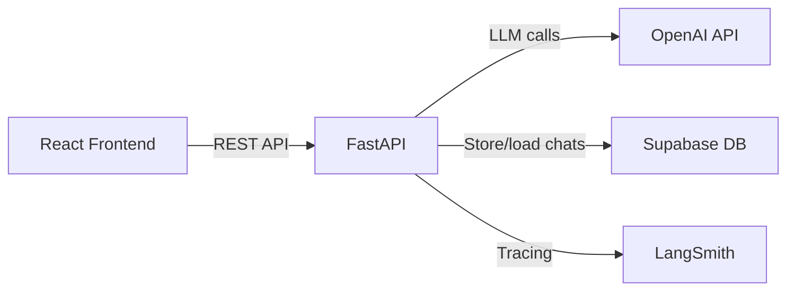
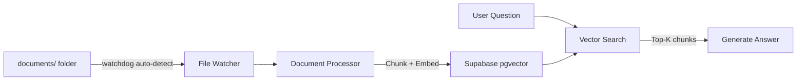
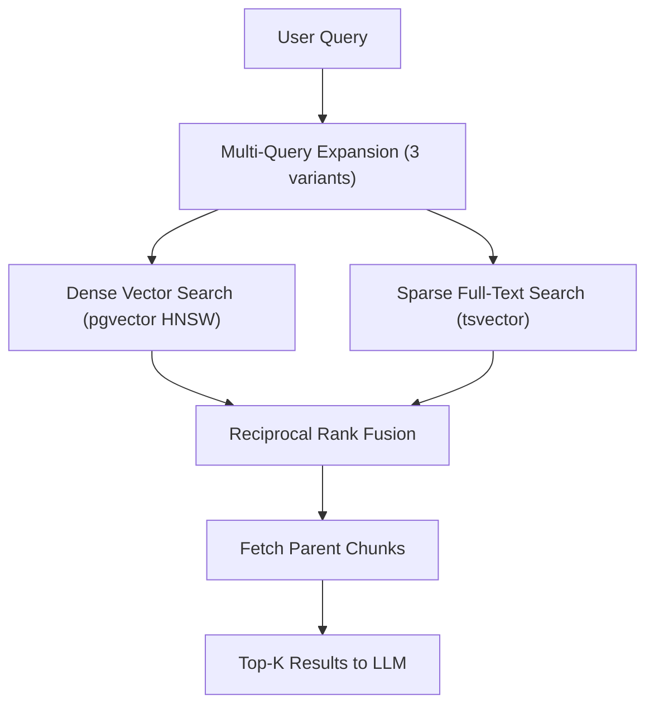
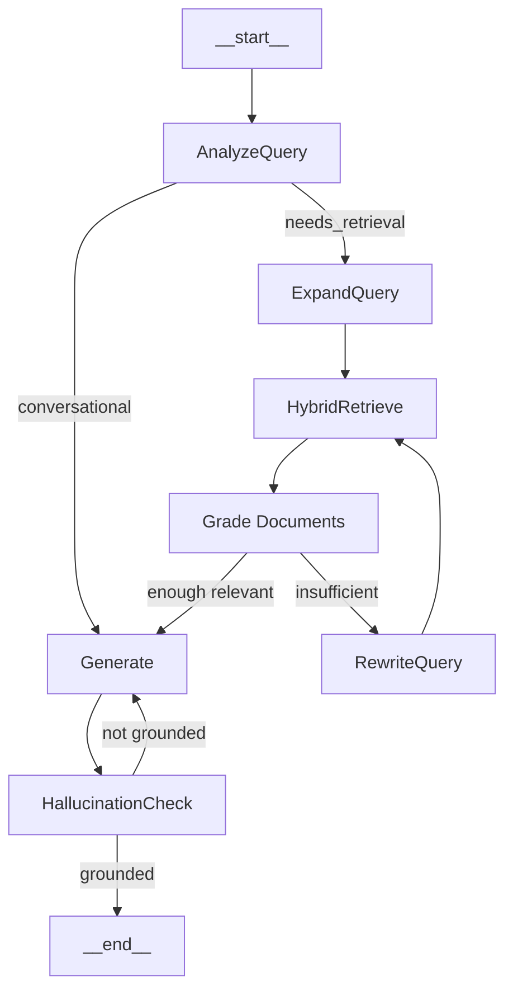

# Phased LangGraph RAG Agent Build

The project is split into 4 phases. Each phase produces a fully working system that builds on the previous one.

---

## Documentation Strategy (MANDATORY -- read before coding any phase)

There are **two types** of markdown documentation in this project. Both are REQUIRED deliverables for each phase -- a phase is NOT complete until its docs are written.

### Type 1: Phase Setup Guides (How-To)

Step-by-step instructions for what you need to do to get each phase running. Practical, action-oriented, zero theory.

- `docs/phase-1-setup.md` -- Setup guide for Phase 1
- `docs/phase-2-setup.md` -- Setup guide for Phase 2
- `docs/phase-3-setup.md` -- Setup guide for Phase 3
- `docs/phase-4-setup.md` -- Setup guide for Phase 4

Each guide includes:

- Prerequisites (what must be done before this phase)
- Exact SQL to run in Supabase (with screenshots-style descriptions of where to go)
- Environment variables to add/change
- Docker commands to rebuild and run
- How to verify the phase works (test scenarios)
- Troubleshooting common errors

### Type 2: Technical Deep-Dive Docs (Concepts Explained)

Detailed educational documents explaining the advanced retrieval methods, architecture decisions, and how each technique works under the hood. Written for learning and understanding.

- Phase 2 delivers: `docs/concepts/embeddings-and-indexes.md`
- Phase 3 delivers: `docs/concepts/hybrid-search.md`, `docs/concepts/chunking-strategies.md`, `docs/concepts/multi-query-retrieval.md`
- Phase 4 delivers: `docs/concepts/document-grading.md`

See the "Concept Docs Detail" section at the end of this plan for the full outline of each concept doc.

---

## Frontend UI Design Spec

The React app should feel like a polished, modern SaaS product -- not a generic chatbot template. Design direction: **clean, minimal, with depth through subtle shadows and micro-interactions**.

### Design System

- **Color palette:**
  - Background: `#0f0f11` (near-black), side panel: `#18181b` (zinc-900)
  - Cards/surfaces: `#1c1c21` with subtle `1px` border `rgba(255,255,255,0.06)`
  - Primary accent: `#6366f1` (indigo-500) for buttons, active states, focus rings
  - Text: `#fafafa` (primary), `#a1a1aa` (secondary/muted zinc-400)
  - User message bubble: `#6366f1` with white text
  - Bot message bubble: `#27272a` (zinc-800) with `#fafafa` text
  - Success: `#22c55e`, Warning: `#f59e0b`, Error: `#ef4444`
- **Typography:** Inter font family (imported from Google Fonts). Sizes: heading 20px/600, body 14px/400, small/caption 12px/400
- **Border radius:** 12px for cards/panels, 20px for message bubbles, 8px for buttons/inputs
- **Shadows:** `0 4px 24px rgba(0,0,0,0.3)` on floating panels, `0 1px 3px rgba(0,0,0,0.2)` on cards

### Layout (Desktop)

```
+------------------+--------------------------------------------+
|                  |           Header (app name, status)         |
|    Sidebar       +--------------------------------------------+
|    (280px)       |                                            |
|                  |           Chat Messages Area                |
|  - New Chat btn  |           (scrollable, centered,            |
|  - Session list  |            max-width 768px)                 |
|  - Each session  |                                            |
|    shows title   |                                            |
|    + timestamp   |                                            |
|                  +--------------------------------------------+
|                  |           Input Bar (sticky bottom)         |
|                  |   [ textarea ] [ send btn ]                |
+------------------+--------------------------------------------+
```

- Sidebar collapses to icon-only on screens < 1024px, hidden with hamburger on mobile
- Chat area is vertically scrollable, auto-scrolls to bottom on new messages
- Input bar uses a `textarea` that auto-grows (1 to 4 rows), sends on Enter (Shift+Enter for newline)

### Component Details

**Sidebar**

- "New Chat" button at top with `+` icon, full-width, indigo background
- Session list: each item shows truncated title (max 1 line) + relative timestamp ("2m ago", "Yesterday")
- Active session highlighted with indigo left border + slightly lighter background
- Hover state: subtle background lighten + smooth 150ms transition
- Delete session: trash icon appears on hover, with confirmation tooltip

**Chat Messages**

- Messages appear with a staggered fade-in + slide-up animation (150ms, CSS `@keyframes`)
- User messages: right-aligned, indigo bubble, rounded corners (top-left, bottom-left, top-right rounded; bottom-right less rounded to indicate direction)
- Bot messages: left-aligned, zinc-800 bubble, small bot avatar icon (circle with sparkle/brain icon)
- **Streaming behavior:** Bot messages render token-by-token in real time as they arrive via SSE (like ChatGPT/Claude). Text grows incrementally, not shown as a complete block. A blinking `|` cursor appears at the end of the text while streaming. Once streaming completes, the cursor disappears and the full message is rendered as markdown. The send button and input are disabled while a response is streaming.
- Empty state: centered illustration/icon with "Start a conversation" text
- Timestamps shown on hover over each message

**Input Bar**

- Dark surface with top border separator
- Rounded textarea with subtle inner glow on focus (`ring-2 ring-indigo-500/40`)
- Send button: indigo circle with arrow icon, disabled state when input empty (opacity 40%)
- Subtle scale animation on send button press

**Documents Page (Phase 2)**

- Top bar: shows watched folder path (`documents/`), total file count, and a status indicator (watching/idle)
- Grid of document cards (responsive: 1 col mobile, 2 cols tablet, 3 cols desktop)
- Each card: file type icon (PDF red, DOCX blue, TXT gray, CSV green), filename, size, date, chunk count
- Status badge: "Processing" (amber pulse animation), "Ready" (green), "Error" (red)
- Auto-refreshes every 5 seconds -- new files appear as the backend watcher processes them
- No upload UI needed -- users just drop files into the `documents/` folder

**Source References (Phase 4)**

- Collapsible section below bot messages: "Sources (N)" with chevron toggle
- Each source: pill/chip showing filename + page number, click to expand the chunk text
- Subtle indigo left border on expanded source content

### Animations and Micro-interactions

- Page transitions: fade (200ms)
- Message appear: slide-up 12px + fade-in (150ms, staggered 50ms per message on load)
- Button press: scale(0.97) on active (100ms)
- Skeleton loaders for chat history loading (3 placeholder message shapes with shimmer)
- Toast notifications (top-right): slide-in from right, auto-dismiss after 4s

### Responsive Breakpoints

- Mobile (< 768px): sidebar hidden behind hamburger, full-width chat, input bar sticks to bottom
- Tablet (768-1024px): sidebar collapses to 64px icon strip, expandable on click
- Desktop (> 1024px): full sidebar 280px + chat area

### Key Libraries

- `tailwindcss` -- utility-first styling
- `lucide-react` -- consistent icon set
- `framer-motion` -- animations (message entrance, page transitions)
- `react-hot-toast` -- toast notifications
- `react-markdown` + `remark-gfm` -- render markdown in bot responses

---

## Phase 1 -- Simple Chatbot (Foundation)

**Goal:** A working chatbot connected to Supabase for chat storage, running in Docker, with a React frontend.




### What gets built

**Backend (`backend/`)**

- `app/config.py` -- Settings loaded from env vars (OpenAI key, Supabase URL/key, LangSmith config)
- `app/supabase_client.py` -- Supabase client initialization
- `app/schemas.py` -- Pydantic models for requests/responses
- `app/agent.py` -- Simple LangGraph agent with a single `generate` node that calls OpenAI `gpt-4o-mini` with chat history
- `app/main.py` -- FastAPI with endpoints: `POST /api/chat` (returns SSE `text/event-stream` -- streams tokens as they are generated by the LLM, each SSE event is a JSON chunk `{type: "token", content: "..."}`, status events `{type: "status", content: "Thinking..."}`, final event `{type: "done"}`), `GET /api/chats`, `GET /api/chats/{id}`. After the first user message in a new session, triggers a background call to the LLM to auto-generate a short chat title (3-6 words) and updates the session in Supabase.
- `requirements.txt` -- Minimal deps: `fastapi`, `uvicorn`, `langgraph`, `langchain-openai`, `supabase`, `python-dotenv`, `langsmith`, `python-multipart`, `sse-starlette`
- `Dockerfile`

**Frontend (`frontend/`)** -- follows the UI Design Spec above

- Vite + React 18 + TypeScript + Tailwind CSS + Framer Motion + Lucide icons
- `components/ChatInterface.tsx` -- Dark-themed message area with indigo user bubbles, zinc bot bubbles, **real-time token-by-token streaming** (bot message text grows word-by-word as SSE events arrive, not shown as a block), blinking cursor at the end of streaming text, auto-scroll to bottom as new tokens arrive, markdown rendering after stream completes, skeleton loaders for initial load, staggered fade-in animations. Shows a **status indicator** above the bot message while processing (e.g. "Thinking..." in Phase 1, upgraded to step-specific labels in Phase 4).
- `components/ThinkingIndicator.tsx` -- Animated status pill shown while the agent is working. Displays the current step label with a pulsing dot animation. In Phase 1 it only shows "Thinking...", in Phase 4 it shows step names like "Retrieving...", "Grading documents...", "Generating..."
- `components/Sidebar.tsx` -- Collapsible sidebar (280px desktop, icon-strip tablet, hamburger mobile), new chat button, session list with active highlight, hover-reveal delete, relative timestamps. Session titles auto-update in the sidebar after the LLM generates them (replaces "New Chat" placeholder).
- `components/InputBar.tsx` -- Auto-growing textarea (1-4 rows), indigo send button with scale animation, Enter to send / Shift+Enter newline
- `components/EmptyState.tsx` -- Centered icon + "Start a conversation" text for new sessions
- `api/client.ts` -- Typed API client. Chat endpoint uses `fetch` with `ReadableStream` reader to consume SSE events in real-time. Handles three event types: `status` (updates thinking indicator), `token` (appends text to bot message), `done` (finalizes message). Exposes callbacks so `ChatInterface` can react to each event type.
- `types/index.ts` -- TypeScript interfaces
- `App.tsx` -- Root layout with responsive sidebar + chat area
- `index.css` -- Tailwind imports + Inter font + custom CSS keyframes
- `Dockerfile` + `nginx.conf`

**Infrastructure**

- `docker-compose.yml` -- Backend (port 8000) + Frontend (port 3000, proxies `/api` to backend). Backend mounts `./documents:/app/documents` volume for the file watcher (used in Phase 2+).
- `.env.example`

**Supabase (2 tables only)**

- `chat_sessions` -- `id`, `title`, `created_at`, `updated_at`
- `chat_messages` -- `id`, `session_id`, `role`, `content`, `created_at`

**Documentation**

- `docs/phase-1-setup.md` -- Step-by-step guide covering:
  - Creating a Supabase project
  - Getting OpenAI and LangSmith API keys
  - Running the SQL migration for chat tables
  - Configuring `.env`
  - Building and running with `docker-compose up`
  - Verifying LangSmith traces
  - Troubleshooting common issues

---

## Phase 2 -- Basic RAG (Folder Watcher + Simple Retrieval)

**Goal:** The backend watches the `documents/` folder for new files, auto-processes them (chunk + embed + store), and the chatbot answers questions using the stored documents via vector search.




### What gets added/changed

**New folder**

- `documents/` -- subfolder in project root where users place files (PDF, DOCX, TXT, CSV, Excel, Markdown). Mounted as a Docker volume.

**Backend -- new files**

- `app/document_processor.py` -- File loading (PDF, DOCX, TXT, CSV, Excel, Markdown), chunking with `RecursiveCharacterTextSplitter` (1000 tokens, 200 overlap), embedding with `text-embedding-3-small`, storing in Supabase
- `app/retriever.py` -- Basic vector similarity search via Supabase RPC `match_documents()`
- `app/watcher.py` -- Uses `watchdog` library to monitor the `documents/` folder. On file create/modify: triggers document processing pipeline. On file delete: removes associated chunks from Supabase. Runs as a background thread on FastAPI startup. Tracks processed files by hash to avoid re-processing unchanged files.

**Backend -- modified files**

- `app/agent.py` -- Add `retrieve` node before `generate`. Agent now: Retrieve -> Generate
- `app/main.py` -- Add `GET /api/documents` (list processed docs + status), start watcher on app startup via lifespan event
- `requirements.txt` -- Add `pypdf`, `python-docx`, `openpyxl`, `unstructured`, `tiktoken`, `watchdog`

**Frontend -- modified/added** (follows UI Design Spec)

- `components/DocumentList.tsx` -- Responsive card grid (1/2/3 cols), file type icon + color coding, status badges (Processing amber pulse / Ready green / Error red), chunk count + file size metadata, auto-refreshes every 5s
- `components/DocumentsPage.tsx` -- Shows watched folder status + DocumentList
- Update `App.tsx` with navigation between Chat and Documents views (sidebar nav items)

**Supabase -- new tables + extensions**

- Enable `vector` extension
- `files` table -- `id`, `filename`, `file_type`, `file_size`, `chunk_count`, `status`, `created_at`
- `documents` table -- `id`, `content`, `metadata` (jsonb), `embedding` (vector(1536)), `file_id` (FK), `created_at`
- `match_documents()` SQL function -- cosine similarity search with optional metadata filter
- IVFFlat index on `embedding` column

**Documentation**

- `docs/phase-2-setup.md` -- Step-by-step guide covering:
  - Enabling pgvector extension in Supabase
  - Running the Phase 2 SQL migration
  - Supported file types and size limits
  - How the folder watcher and auto-processing pipeline works
  - Placing files in `documents/` and watching them get processed
  - Testing questions against ingested documents
  - Monitoring token usage

---

## Phase 3 -- Advanced Retrieval (Hybrid Search)

**Goal:** Upgrade from basic vector search to production-grade hybrid retrieval with dense + sparse search, parent-child chunking, and multi-query expansion.




### What gets added/changed

**Backend -- modified files**

- `app/retriever.py` -- Complete rewrite:
  - Hybrid search calling `hybrid_search()` Supabase RPC
  - Multi-query expansion (LLM generates 3 query variants)
  - Parent chunk lookup (match on children, return parents)
  - Result deduplication by parent ID
  - Metadata filtering support
- `app/document_processor.py` -- Add parent-child chunking:
  - Parent chunks: 2000 tokens, 200 overlap -> stored in `parent_chunks`
  - Child chunks: 500 tokens, 50 overlap -> stored in `documents` with `parent_id` FK

**Supabase -- schema changes**

- `parent_chunks` table -- `id`, `content`, `metadata`, `file_id`, `chunk_index`, `created_at`
- Add `parent_id` FK and `fts` tsvector generated column to `documents`
- Upgrade index from IVFFlat to **HNSW** on `embedding`
- Add **GIN** index on `fts` column
- Add **GIN** index on `metadata` column
- `hybrid_search()` SQL function -- CTEs for dense + sparse search, RRF scoring, parent join

**Documentation**

- `docs/phase-3-setup.md` -- Detailed guide covering:
  - What hybrid search is and why it matters (dense vs sparse trade-offs)
  - How Reciprocal Rank Fusion works (with formula)
  - Parent-child chunking strategy explained
  - Running the Phase 3 SQL migration (indexes, functions)
  - Re-processing existing documents for parent-child structure
  - Performance tuning (HNSW parameters, RRF k constant)

---

## Phase 4 -- Intelligent Agent (Grading, Rewriting, Hallucination Check)

**Goal:** Upgrade the LangGraph agent from a simple 2-node pipeline to an intelligent agent that grades documents, rewrites queries, and checks for hallucinations.




### What gets added/changed

**Backend -- modified files**

- `app/agent.py` -- Complete rewrite with 7 nodes. Each node emits a `status` SSE event before executing so the frontend shows the current step:
  - `analyze_query` -- Classify: needs retrieval or conversational. Emits `"Analyzing question..."`
  - `expand_query` -- Generate 3 query variants. Emits `"Expanding query..."`
  - `hybrid_retrieve` -- Call advanced retriever from Phase 3. Emits `"Searching documents..."`
  - `grade_documents` -- LLM grades each chunk as relevant/irrelevant. Emits `"Grading relevance..."`
  - `rewrite_query` -- LLM rephrases question if not enough relevant docs (max 1 retry). Emits `"Rewriting query..."`
  - `generate` -- Produce answer from graded relevant docs + chat history. Emits `"Generating answer..."`
  - `check_hallucination` -- LLM verifies answer is grounded in docs (max 1 retry). Emits `"Verifying answer..."`
- `app/schemas.py` -- Add grading models, expanded agent state
- `app/main.py` -- Add source references in chat responses (which chunks were used)

**Frontend -- modified** (follows UI Design Spec)

- `components/ChatInterface.tsx` -- Add collapsible "Sources (N)" section below bot messages with chevron toggle, source pills showing filename + page, expandable chunk text preview with indigo left border
- `components/SourceCard.tsx` -- Individual source reference component with expand/collapse animation

**Supabase -- schema changes**

- Add `sources` (jsonb) column to `chat_messages` for storing which chunks were referenced

**Documentation**

- `docs/phase-4-setup.md` -- Detailed guide covering:
  - LangGraph agent architecture explained (each node's purpose)
  - How document grading works and why it improves quality
  - Query rewriting strategy
  - Hallucination detection approach
  - Running the Phase 4 migration
  - Viewing full agent traces in LangSmith (node-by-node)
  - Performance considerations (LLM calls per query)

---

## Concept Docs Detail

Full outlines for each technical deep-dive document:

- `docs/concepts/embeddings-and-indexes.md` -- **Embeddings and Vector Indexes Explained** (Phase 2)
  - What embeddings are (text to high-dimensional vectors)
  - OpenAI text-embedding-3-small: dimensions, cost, performance
  - Exact vs. approximate nearest neighbor search
  - IVFFlat vs. HNSW indexes: how they work, trade-offs, when to use which
  - PostgreSQL pgvector: distance operators (cosine, L2, inner product)
  - Index tuning parameters (m, ef_construction for HNSW)
- `docs/concepts/hybrid-search.md` -- **Hybrid Search Explained** (Phase 3)
  - What is dense (vector) search and how embeddings represent meaning
  - What is sparse (keyword/BM25) search and how tsvector/tsquery work in PostgreSQL
  - Why neither alone is sufficient (examples of queries where each fails)
  - How hybrid search combines both approaches
  - Reciprocal Rank Fusion (RRF) formula with worked example
  - The SQL implementation walkthrough (CTE by CTE)
  - Tuning the RRF k constant and its effect on results
- `docs/concepts/chunking-strategies.md` -- **Chunking Strategies Explained** (Phase 3)
  - Why chunking matters for RAG quality
  - Naive chunking vs. recursive character splitting
  - Token-based vs. character-based chunk sizes
  - Parent-child chunking: the problem it solves (precision vs. context trade-off)
  - How child chunks are used for search and parent chunks for generation
  - Chunk size and overlap tuning guidance
  - Diagrams showing how a document flows through the pipeline
- `docs/concepts/multi-query-retrieval.md` -- **Multi-Query Expansion Explained** (Phase 3)
  - The vocabulary mismatch problem
  - How the LLM generates alternative phrasings
  - How results from multiple queries are deduplicated and merged
  - Examples showing improved recall vs. single-query search
- `docs/concepts/document-grading.md` -- **Document Grading and Query Rewriting Explained** (Phase 4)
  - Why retrieved documents are not always relevant
  - How the LLM grades each chunk (prompt design, binary classification)
  - The conditional rewrite loop: when and how query rewriting triggers
  - Hallucination checking: how the LLM verifies its own answer against source docs
  - The full LangGraph agent flow with decision points illustrated

---

## File Delivery Order

Each phase is implemented fully before moving to the next:

- **Phase 1:** `config.py` -> `supabase_client.py` -> `schemas.py` -> `agent.py` (simple) -> `main.py` -> `Dockerfile` -> frontend scaffold -> `docker-compose.yml` -> `.env.example` -> `supabase_setup.sql` (chat tables) -> `docs/phase-1-setup.md`
- **Phase 2:** `document_processor.py` -> `retriever.py` (basic) -> `watcher.py` (folder monitor) -> update `agent.py` -> update `main.py` -> `DocumentList.tsx` -> `DocumentsPage.tsx` -> update SQL migration -> `docs/phase-2-setup.md` -> `docs/concepts/embeddings-and-indexes.md`
- **Phase 3:** rewrite `retriever.py` (hybrid) -> update `document_processor.py` (parent-child) -> update SQL migration (hybrid_search func, indexes) -> `docs/phase-3-setup.md` -> `docs/concepts/hybrid-search.md` -> `docs/concepts/chunking-strategies.md` -> `docs/concepts/multi-query-retrieval.md`
- **Phase 4:** rewrite `agent.py` (7 nodes) -> update `schemas.py` -> update `main.py` (sources) -> update frontend (sources display) -> update SQL migration -> `docs/phase-4-setup.md` -> `docs/concepts/document-grading.md`

