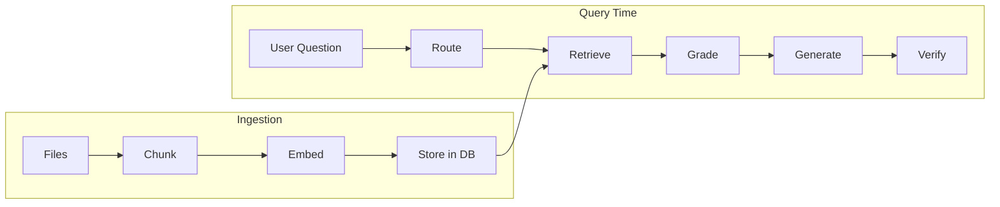

# RAG Methods Overview and Summary

This document is a high-level overview of the **Retrieval-Augmented Generation (RAG)** methods used in this project. It summarizes techniques across ingestion, retrieval, and generation so you can see the full picture in one place.

---

## What Is RAG?

**RAG** augments a large language model (LLM) with **retrieved documents**: instead of relying only on the model’s training, we search a corpus (your uploaded files), pass the best-matching chunks as context, and instruct the model to answer **only from that context**. That reduces hallucination and keeps answers grounded in your data.

---

## Pipeline at a Glance

- **Ingestion:** Documents → chunking → embeddings + full-text → stored in PostgreSQL (pgvector + tsvector).
- **Query time:** User question → routing (retrieval vs conversational) → retrieval → grading → generation → verification (hallucination check).

---

## Methods Used in This Project

### 1. Document Chunking

- **What:** Split each document into smaller pieces so we can search and pass only relevant parts to the LLM.
- **Method:** **Parent-child chunking** (Phase 3).  
  - **Parents:** Larger chunks (e.g. 2000 tokens, 200 overlap) for **context** given to the LLM.  
  - **Children:** Smaller chunks (e.g. 500 tokens, 50 overlap) for **search**; only children are embedded and full-text indexed.
- **Why:** Small chunks improve search precision; large chunks improve answer coherence. Parent-child gives both.
- **Details:** [docs/concepts/chunking-strategies.md](concepts/chunking-strategies.md).

---

### 2. Embeddings and Dense Search

- **What:** Turn text into a fixed-size vector (embedding) and find chunks whose vectors are closest to the query vector.
- **Method:** **OpenAI text-embedding-3-small** (1536 dimensions). Cosine similarity in PostgreSQL via **pgvector** with an **HNSW** index for fast approximate nearest neighbor search.
- **Why:** Captures **meaning**; works across paraphrasing and synonyms.
- **Details:** [docs/concepts/embeddings-and-indexes.md](concepts/embeddings-and-indexes.md).

---

### 3. Sparse (Full-Text) Search

- **What:** Match query words against document text using keyword/lexical signals.
- **Method:** PostgreSQL **tsvector** / **tsquery** and **GIN** index. Query is normalized with `plainto_tsquery('english', query)`; ranking with `ts_rank`.
- **Why:** Good for exact terms, names, codes, and phrases that dense search can miss.
- **Details:** [docs/concepts/hybrid-search.md](concepts/hybrid-search.md).

---

### 4. Hybrid Search and RRF

- **What:** Combine dense and sparse search so we get both semantic and keyword relevance.
- **Method:** Run **dense** and **sparse** searches separately, then merge rankings with **Reciprocal Rank Fusion (RRF)**. Score for an item at rank \(r\) in a list: \(1/(k + r)\) with \(k = 60\); sum scores across lists and sort by total.
- **Where:** Implemented in SQL (`hybrid_search()`) and in Python when merging multiple query variants.
- **Details:** [docs/concepts/hybrid-search.md](concepts/hybrid-search.md).

---

### 5. Multi-Query Expansion

- **What:** Generate several phrasings of the user question and search with each to improve recall.
- **Method:** LLM produces **2 extra variants** (3 queries total). For each variant we run hybrid search; results are merged with RRF and deduplicated.
- **Why:** Reduces vocabulary mismatch (user wording vs document wording).
- **Details:** [docs/concepts/multi-query-retrieval.md](concepts/multi-query-retrieval.md).

---

### 6. Query Routing (Analyze Query)

- **What:** Decide whether the user message needs document retrieval or is conversational (e.g. greeting, thanks).
- **Method:** LLM classifies with a short prompt; output is JSON `{"needs_retrieval": true|false}`. If false, we skip retrieval and use a conversational system prompt.
- **Why:** Saves cost and avoids forcing “I don’t have the answer” on chit-chat.

---

### 7. Document Grading

- **What:** After retrieval, filter out chunks that don’t actually help answer the question.
- **Method:** LLM is given the question and the list of retrieved chunks; it outputs one label per chunk: **relevant** or **irrelevant**. Only relevant chunks form the context for generation.
- **Why:** Similarity ≠ relevance; grading reduces noise and hallucination.
- **Details:** [docs/concepts/document-grading.md](concepts/document-grading.md).

---

### 8. Query Rewriting (Conditional)

- **What:** If too few chunks are graded relevant, rephrase the question and retrieve again.
- **Method:** LLM rewrites the question (different wording/synonyms); we run retrieval and grading again with the new query. **Max one rewrite** to avoid loops.
- **Why:** First phrasing may not match how the document is written.
- **Details:** [docs/concepts/document-grading.md](concepts/document-grading.md).

---

### 9. Generation with Context

- **What:** Produce the final answer using only the graded context (or a “no documents” / conversational prompt).
- **Method:** System prompt instructs the model to answer **only** from the provided context; if the answer isn’t there, reply with a fixed “I don’t have the answer in my documents.” We avoid citing “chunk 1” etc.; we ask for natural phrasing (“According to the document…”).
- **Why:** Keeps answers grounded and avoids mentioning internal structure.

---

### 10. Hallucination Check

- **What:** Verify that the generated answer doesn’t add facts absent from the context.
- **Method:** LLM is given the context and the assistant reply; it returns **grounded** or **not_grounded**. If not_grounded, we allow **one retry** (regenerate then check again).
- **Why:** Catches model “fill-in” and improves trustworthiness.
- **Details:** [docs/concepts/document-grading.md](concepts/document-grading.md).

---

### 11. Source References

- **What:** Track which chunks were used for each answer and show them in the UI.
- **Method:** When building context from graded chunks, we also build a **sources** list (filename, chunk index, snippet). This is stored with the assistant message (Phase 4 `sources` column) and sent in the stream; the frontend shows a collapsible “Sources (N)” section with expandable snippet cards.
- **Why:** Transparency and traceability for users.

---

## Summary Table

| Method              | Phase | Purpose |
|---------------------|-------|---------|
| Parent-child chunking | 3   | Better search (children) + better context (parents). |
| Embeddings + HNSW    | 2–3  | Dense semantic search. |
| Full-text (tsvector) | 3   | Sparse keyword search. |
| Hybrid + RRF         | 3   | Combine dense and sparse rankings. |
| Multi-query expansion | 3  | Several phrasings → better recall. |
| Query routing        | 4   | Skip retrieval for conversational turns. |
| Document grading     | 4   | Keep only relevant chunks. |
| Query rewriting      | 4   | Second chance when few chunks are relevant. |
| Grounded generation  | 1–4 | Answer only from context. |
| Hallucination check  | 4   | Verify answer is supported; optional retry. |
| Source references   | 4   | Show which chunks supported the answer. |

---

## Where to Read More

- **Setup (how to run):** [docs/phase-1-setup.md](phase-1-setup.md) … [docs/phase-4-setup.md](phase-4-setup.md).  
- **Concepts (deep dives):** [docs/concepts/](concepts/) — embeddings, hybrid search, chunking, multi-query, document grading.  
- **Advanced plan concepts (Phases 5–7):** [docs/concepts/advanced-rag-plan-concepts.md](concepts/advanced-rag-plan-concepts.md) — reranking, HyDE, RAGAS, semantic caching, guardrails, multimodal RAG, semantic chunking, web fallback, inline citations, embedding fine-tuning.  
- **Architecture and code:** [docs/guide/](guide/) — backend/frontend structure, agent nodes, API, errors, glossary.

This file is the **overview and summary** of the RAG methods used in the project; the concept docs and guide provide the details.
